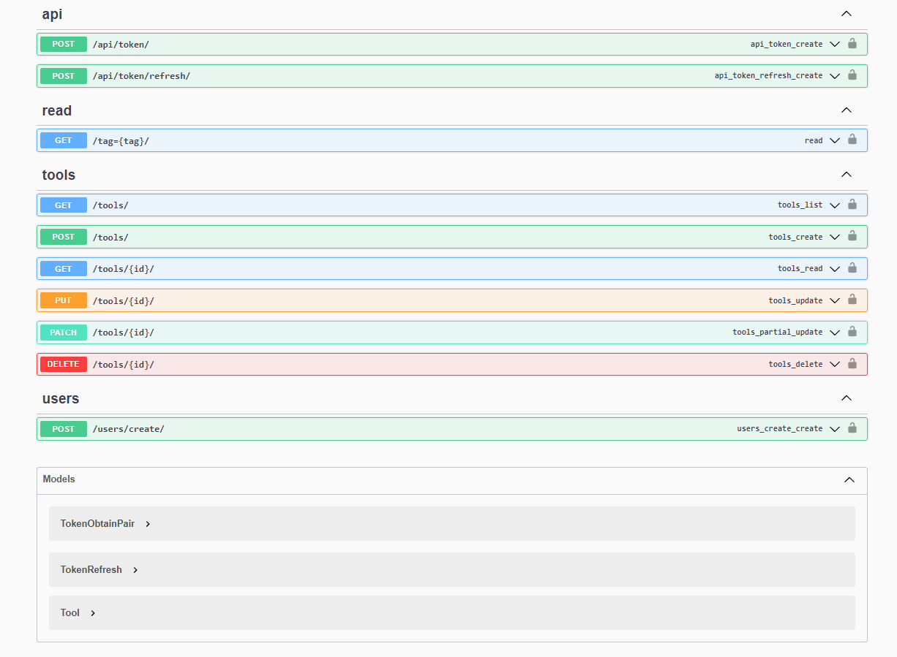

# Notion Backend Test

Project for the Notion Backend Test made using Django / Django Rest Framework, PostgreSQL.

## How to Run

- install postgreSQL
- install Python 3.10
- pip install -r requirements.txt
- configure postgreSQL database to Django in api/settings.py
- python manage.py runserver

## 🛠 Tech

- Python
- API
- Django
- Django Rest Framework
- PostgreSQL
- Git and Github

## 💛 Contact

andremayerusa@gmail.com

## Project Description

https://www.notion.so/Back-end-0b2c45f1a00e4a849eefe3b1d57f23c6
